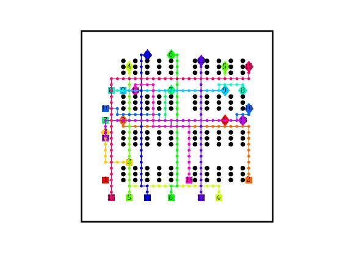
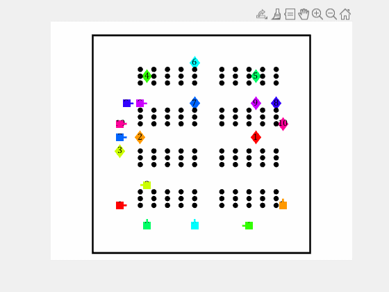

# MRPP-MATLAB
New Multi robot path planning algorithms implemented in MATLAB. 
Including heuristic search and incremental heuristic search methods. 

(Procedural programming)

<table style="padding:10px">
  <tr>
    <td></td>
    <td></td>
  </tr>
</table>

## Methods
- MAStar: Multi-Robot A* based path planning
- ...

