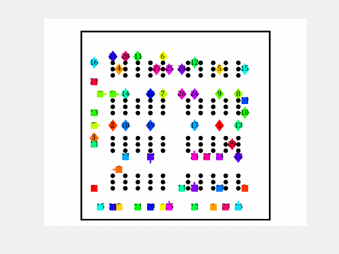

# MRPP-MATLAB

New Multi robot path planning algorithms implemented in MATLAB.
Including heuristic search and incremental heuristic search methods.

(Procedural programming)

<table style="padding:10px">
  <tr>
    <td></td>
    <td></td>
  </tr>
</table>

## Methods

- MAStar: Multi-Robot A* based path planning
- ...

## Run

- Go into the methods directory.
- Run the **RUN_[Methods_name].m** file.
  - MAStar/RUN_MAStar.m

## General

Apart from each path planning method's directory, there are two general directories:

- **common**: common functionalities used in all planning methods
- **models**: functions for creating and saving models (configurations).

## Common Settings

can change this setting in the Run_[method].m file

- distance type: **Model.distType** ('euclidean' or 'manhattan')
- distance type: **Model.adjType** ('4adj' or '8adj')

## Configuration - Models

Initial configuration includes:

- Map (free nodes)
- obstacles (occupied nodes)
- robot's start node
- robot's goal node
- ...

To change the configuration, you can edit the **createModel_#.m** file.

## Simulation

<td></td>
